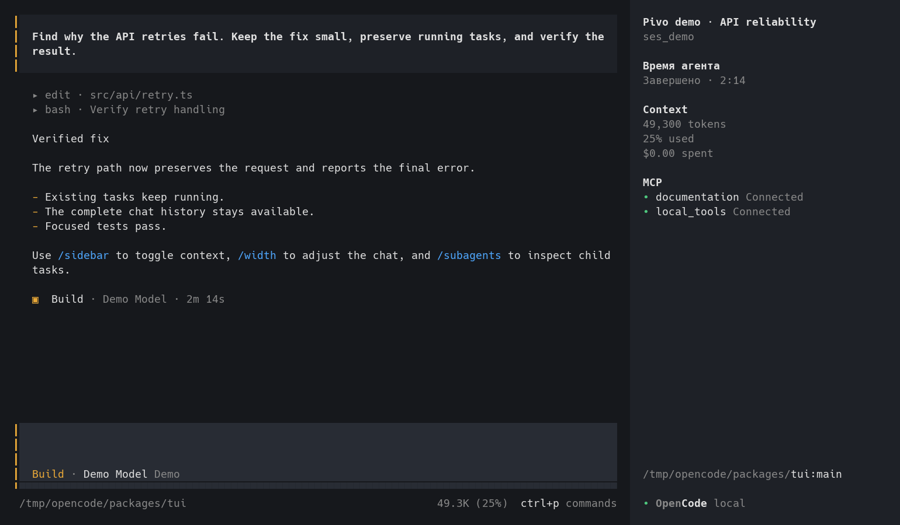
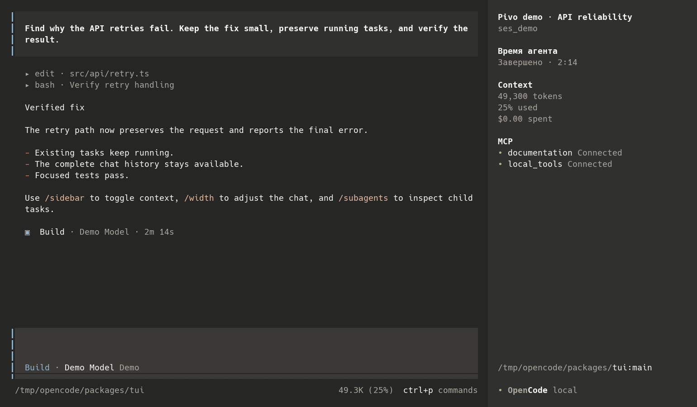
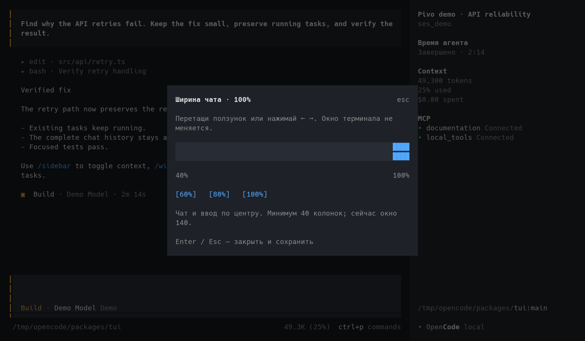
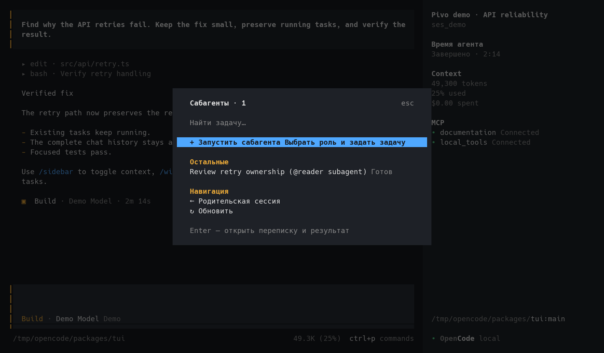
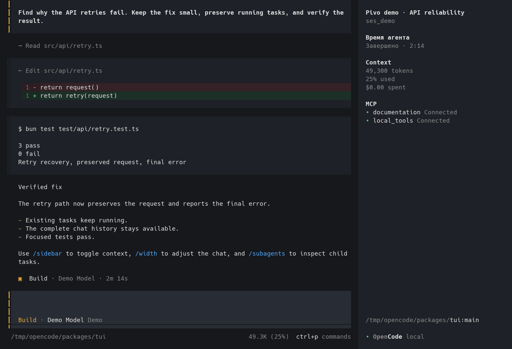
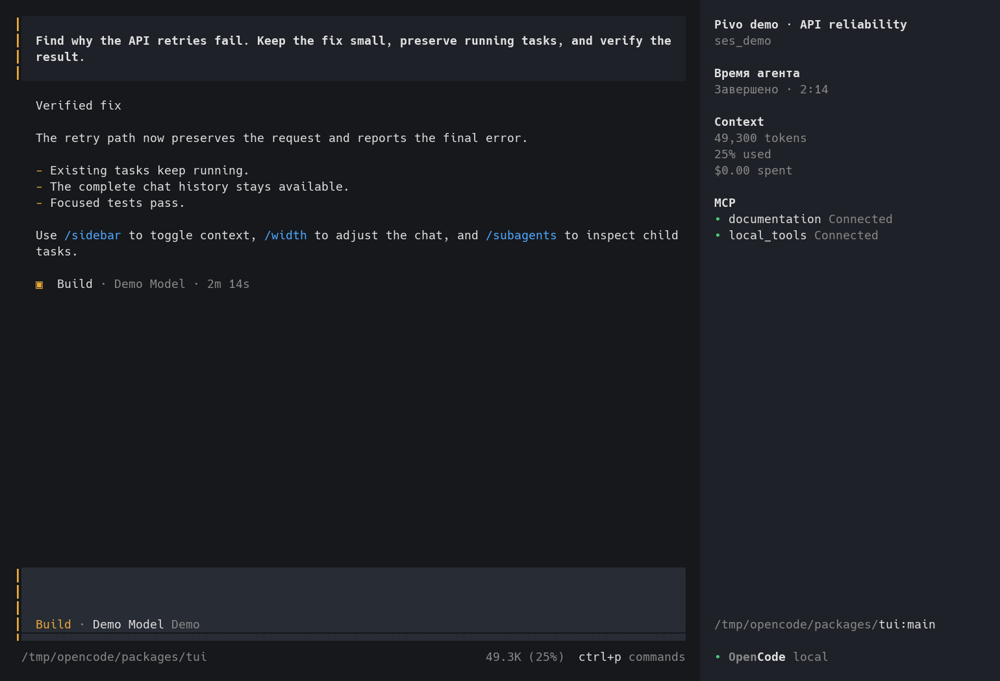

# 🍺 Pivo

Независимая TUI-оболочка на OpenCode **1.18.34-pivo.7** и необязательная сборка
Warp Pivo для macOS. Pivo работает и в других терминалах. Это исходные патчи,
темы и скрипты сборки, а не копия пользовательского HOME или готовый бинарный релиз.

## Что входит

- Pivo wordmark и заголовок терминала `🍺 Pivo | …`.
- Скрытое по умолчанию reasoning, без пустых блоков; `/thinking` возвращает его.
- Компактные раскрываемые важные инструменты; `/important` и `/tools`.
- `/usage` — остатки квоты OpenAI OAuth без вызова модели.
- `/resume` — прошлые сессии; `/subagents` — меню сабагентов и их результатов.
- `/steer` — доставка сохранённой очереди после текущего шага **без отмены задач**.
- `/width` — настоящий ползунок ширины чата/ввода, с сохранением настройки.
- Тёплые темы Amber, Ember, Cocoa, Olive и `claude-pivo-orig`.
- `pivo-kimi` — синие и жёлтые акценты Kimi; жирный пользовательский текст в Kimi/Claude-палитрах.
- История чата доступна целиком: интерфейс больше не отбрасывает начало после 100 сообщений.
- Таймер в правом sidebar: текущая работа и итоговая длительность последнего хода.
- `/sidebar` — показать или скрыть правую панель той же командой, что и в меню.
- Warp: крупная кружка в левой вертикальной вкладке Pivo, с исправленной высотой
  строки; в компактной подписи одновременно папка и Git-ветка. Обычные терминальные
  вкладки сохраняют свой значок. Нижняя панель внешних CLI с файлами и контекстом включена.
- Warp, full-screen приложения (Claude Code, vim, lazygit): поля только по бокам
  (`appearance.full_screen_apps.horizontal_padding_only`), ячейки с явным фоном цвета темы
  рисуются прозрачными, как фон окна; в нижней панели CLI-агента два ползунка — поля в % ширины
  панели и прозрачность окна. `scripts/warpctl` правит те же настройки из терминала.
- Claude Code: семь тем в `claude/themes/` (`~/.claude/themes/`, выбор в `/theme`) и мод
  `claude/mod/pivo` — `/sidebar` (модель, контекст, стоимость, лимиты, todo, MCP), `/tool`
  (все / только важные / скрыть вызовы инструментов), жирные сообщения пользователя.
  Подключение: `CLAUDE_CODE_PLUGIN_DIRS=/path/to/claude/mod/pivo` в `env` файла
  `~/.claude/settings.json` или `claude --plugin-dir`.

Подробно: [команды и поведение](docs/USAGE.md), [настройки, инструкции и навыки](docs/CONFIGURATION.md),
[лицензии](NOTICE.md), [проверки версии](docs/VERIFICATION.md).

**[Полный справочник slash-команд, skills и всех пунктов меню](docs/COMMANDS.md)** —
названия, алиасы, назначение, условно доступные действия и управление diff viewer.

## Как выглядит

Тема **pivo-kimi**, жирный пользовательский запрос, компактный инструмент и sidebar
с таймером, контекстом и MCP:



<details>
<summary>Claude-палитра, ползунок ширины и сабагенты</summary>







</details>

<details>
<summary>Инструменты: полный, компактный и скрытый режим</summary>

**Все инструменты с деталями** — `/important` переключает фильтр:



**Только важные, компактными раскрываемыми строками** — стандартный режим Pivo:


**Инструменты скрыты** — `/tools`:



Ошибки и выполняющиеся вызовы остаются видимыми по правилам оболочки; в этом примере
все вызовы успешно завершены, поэтому скрытый режим показывает только переписку.

</details>

Кадры получены из настоящего OpenTUI-рендера на демонстрационных данных. Это не
снимки личной сессии и не доказательство выполнения задачи из текста примера.
Шрифт кадров — Hack, 18px; размеры и начертание зависят от твоего терминала.
Способ повторения: [docs/screenshots/README.md](docs/screenshots/README.md).

## Сборка Pivo

Нужны Git, Python 3.10+, Bun **1.3.14** и интернет. Проверенная платформа — macOS arm64;
скрипт также выбирает native Linux/x64/arm64 targets upstream, но они здесь не тестировались.

```sh
git clone https://github.com/KMNervanin/pivo.git
cd pivo
python3 scripts/build.py build opencode
python3 scripts/build.py test opencode
python3 scripts/build.py install-pivo
python3 scripts/build.py install-themes
export PATH="$HOME/.local/bin:$PATH"
pivo
```

Если Bun не установлен глобально, при наличии Node/npm запускай команды так:

```sh
npm exec --yes --package=bun@1.3.14 -- python3 scripts/build.py build opencode
npm exec --yes --package=bun@1.3.14 -- python3 scripts/build.py test opencode
```

`build` получает **точный** commit из `upstream.json`, проверяет и накладывает патч
в `.build/opencode`, устанавливает зависимости по lockfile и пишет `dist/pivo`.
Install копирует бинарник атомарно в `~/.local/share/pivo/opencode`, launcher —
в `~/.local/bin/pivo`. Рабочие процессы продолжают использовать прежний executable.
Для обновления выйди из Pivo и запусти `pivo --continue`; Warp ради этого перезапускать не надо.

Сборка использует `OPENCODE_CHANNEL=latest` ради совместимости `opencode.db`, но
launcher отключает автообновление. Web UI не встраивается. Официальный `opencode`
не заменяется; **конфиг, OAuth и база сессий общие**, отдельной изоляции данных нет.

При смене патча подготовленный checkout намеренно не перезаписывается: перемести
`.build/opencode` в резервный каталог и запусти сборку снова. Для разработки можно
явно указать `--source /path/to/patched/opencode`; тогда подготовка пропускается.
Upstream-сборка скачивает текущий каталог `models.dev`: для повторения одного
снимка передай `MODELS_DEV_API_JSON=/absolute/path/api.json`. Побитовая идентичность
сборок без закрепления этого снимка, toolchain и окружения не обещается.

## Warp Pivo — macOS

Необходимы полный Xcode, Command Line Tools, Metal Toolchain, Git LFS, jq,
Rust **1.92.0**, cargo-bundle **0.11.0**, cargo-about **0.9.2**.
На Apple Silicon Homebrew Rustup находится в `/opt/homebrew/opt/rustup/bin`.

```sh
brew install git-lfs jq rustup cargo-about
export PATH="/opt/homebrew/opt/rustup/bin:$HOME/.cargo/bin:$PATH"
rustup toolchain install 1.92.0
cargo +1.92.0 install cargo-bundle --version 0.11.0 --locked
xcodebuild -downloadComponent MetalToolchain
python3 scripts/build.py build warp
```

Результат — `dist/Warp Pivo.app`. Сборка загружает LFS, сохраняет AGPL/MIT и
генерирует third-party notices, затем выполняет локальную ad-hoc подпись и её проверку.
Генерация notices не пропускается при ошибке. Сборка занимает несколько минут и много
места; bundle поддерживает профиль `~/.warp-oss`, ID `dev.warp.WarpOss`, URI `warposs://`.
Это тот же профиль, что и у других Warp OSS-сборок, но отдельный от обычного Warp.

Установка: `python3 scripts/build.py install-warp`. Старая `.app`, если есть,
сохраняется в `/Applications/Warp Pivo-backup-<timestamp>.app`. Скрипт не завершает
процессы: когда закончишь живые задачи, закрой и снова открой **только Warp Pivo**,
чтобы новая сборка вступила в силу. Обычный Warp не заменяется. Скрипты окна не
открывают. Сборка не нотарифицирована Apple.

Чтобы отключить встроенные Warp-агенты и cloud settings sync, объедини
`config-examples/warp-settings.toml` со своим `~/.warp-oss/settings.toml`, а
`warp-keybindings.yaml` — с `~/.warp-oss/keybindings.yaml`. Для оригинального Warp
тот же набор находится в `~/.warp/`. Не заменяй целиком существующие файлы:
сохрани остальные настройки. TOML применяется на лету, keybindings — после перезапуска.
Панель внешних CLI (`should_render_cli_agent_toolbar`) остаётся **включённой**, а
встроенные агенты — выключенными. Custom command pattern распознаёт `pivo` как OpenCode;
старые вкладки, запущенные до добавления pattern, требуют нового запуска команды
`pivo --continue`. Они автоматически не останавливаются и не перерегистрируются.

Launch config `~/.warp-oss/launch_configurations/pivo.yaml` (замени `/absolute/home`):

```yaml
---
name: Pivo
windows:
  - tabs:
      - title: "🍺 Pivo"
        layout:
          cwd: /absolute/home
          commands:
            - exec: /absolute/home/.local/bin/pivo
```

После установки приложения: `open 'warposs://launch/pivo'`.

## Claude Code — темы и мод

Claude Code 2.1.29x читает custom-темы из `~/.claude/themes/*.json` и грузит плагины с
function hooks из каталогов в `CLAUDE_CODE_PLUGIN_DIRS`. Установка:

```sh
python3 scripts/build.py install-claude
```

Скрипт копирует семь тем (`pivo-claude`, `claude-pivo-orig`, `pivo-amber`, `pivo-ember`,
`pivo-cocoa`, `pivo-olive`, `pivo-kimi`) и мод в `~/.claude/mods/pivo`, затем печатает
одну строку для `~/.claude/settings.json`:

```json
"env": { "CLAUDE_CODE_PLUGIN_DIRS": "~/.claude/mods/pivo" }
```

После перезапуска Claude Code: тема выбирается в `/theme`; `/sidebar` докует правую панель
(модель, время сессии, контекст, стоимость, лимиты по местному времени, todo, список MCP);
`/tool` переключает показ вызовов инструментов — все, только важные (правки, shell, вопросы,
агенты, MCP, ошибки) или скрытые; `/accent` красит твои сообщения в цвет темы, жирность у них
всегда. Темы используют truecolor-базу `dark`: в ANSI-базе движок квантует цвета в 16 цветов
терминала и приглушённые дифы невозможны. Фон панелей и твоих сообщений равен фону
Warp-темы, поэтому в Warp Pivo они прозрачные.

Warp-настройки для Claude Code и других full-screen приложений живут в
`appearance.full_screen_apps`; `scripts/warpctl pad 200`, `warpctl sides on`, `warpctl opacity 60`
правят их из терминала, а ползунки в нижней панели — мышью, отдельно для каждой группы панелей.

## Разработка

`patches/opencode.patch` содержит все изменения и новые тесты; `patches/warp.patch`
содержит вертикальную вкладку, поля и прозрачность full-screen приложений и ползунки
нижней панели. Точные базы и лицензии закреплены в
`upstream.json`. Штатные `AGENTS.md`, skills и документация upstream остаются в
подготовленных checkout. Личные правила и MCP-учётные данные не требуются для сборки.

Экспорт из checkout, стоящих на закреплённых upstream SHA (локальные коммиты поверх
допустимы, патч всегда считается от закреплённой базы):

```sh
python3 scripts/export-patches.py /path/to/opencode /path/to/warp
python3 scripts/build.py prepare opencode
python3 scripts/build.py prepare warp
```

Экспорт ограничен явным списком файлов: при добавлении новой исходной единицы обнови
список, проверь diff, повторно проверь патчи на чистой базе. Не включай `.env`,
`auth.json`, `opencode.db`, личные конфиги или приватные журналы в commits.

## Почему репозиторий публичный

MIT разрешает модификацию и публикацию OpenCode при сохранении notices. Warp client
разрешает публичные производные под AGPLv3; WarpUI отдельно лицензирован MIT.
Чужое авторство не требует приватного репозитория. Условия распространения готовых
бинарников и границы лицензий подробно зафиксированы в [NOTICE.md](NOTICE.md).
